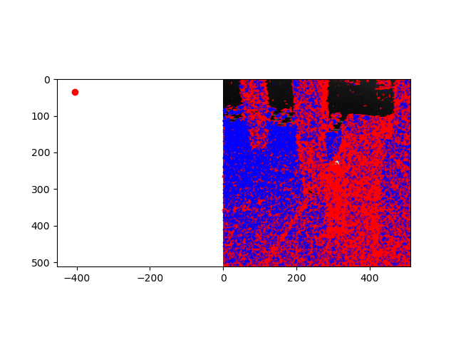
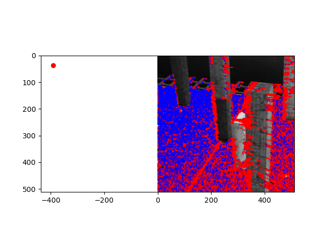
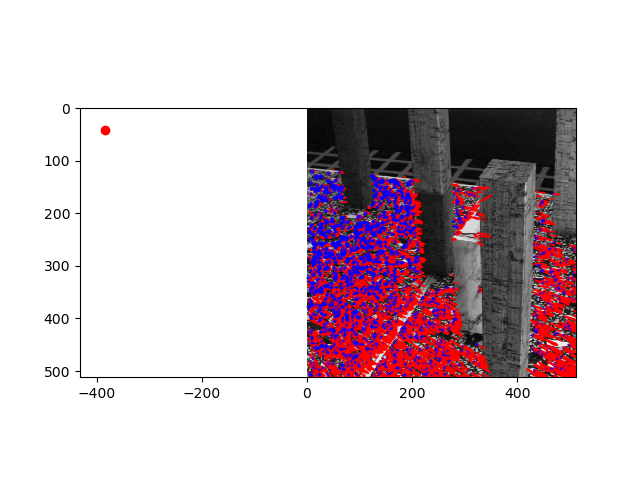
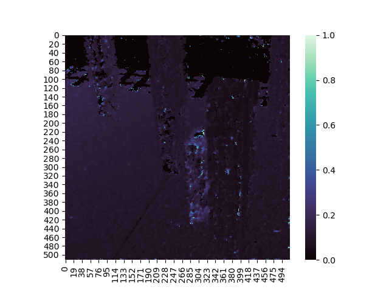
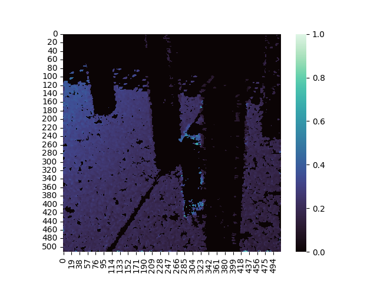
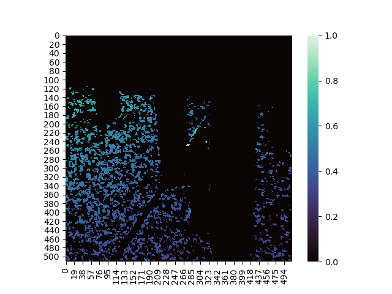
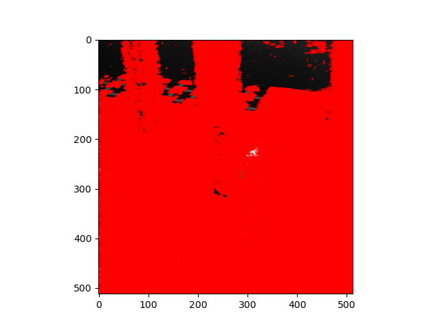
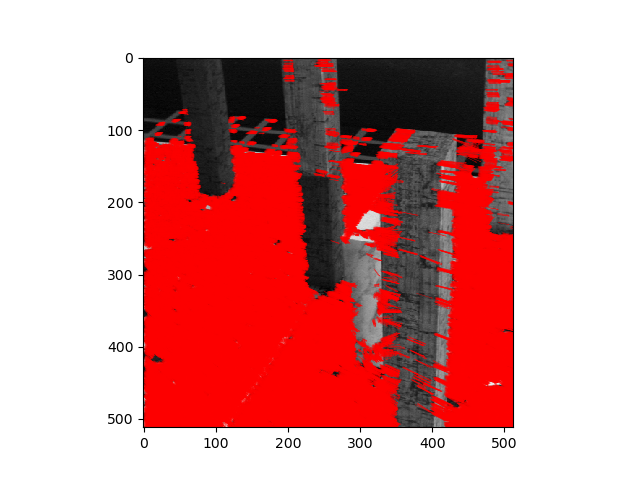
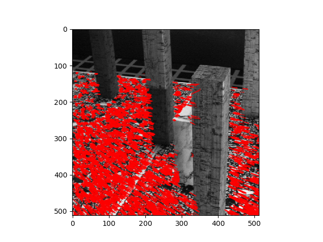

# Optical flow

## Output
### Inliers for thresmin = 1, 10, 30
Inliers threshmin = 1
\
Inliers threshmin = 10
\
Inliers threshmin = 30


### Depth map for thresmin = 1, 10, 30
depth threshmin = 1
\
depth threshmin = 10
\
depth threshmin = 30


### vector field for thresmin = 1, 10, 30
flow threshmin = 1
\
flow threshmin = 10
\
flow threshmin = 30


## Running
To run this program:

```
python3 main.py [list of arguments]
```
For example
```
python3 main.py --plot_flow
python3 main.py --depth --threshmin 5
```