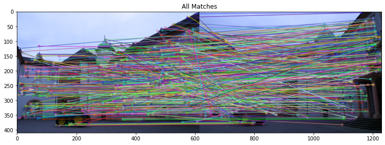

# 3D RECONSTRUCTION FROM IMAGES

The entire pipeline consists of different parts -
## Using optical flow to get point correspondences and estimate depths.

### Optical flow is computed first. The smallest singular value of spatiotemporal derivative matrix is calculated and only those pixels which are above a threshold value are considered. the flow vectors are shown below 

### Epipoles after RANSAC and satisfying planar condition equation by a threshold

### Depths are then calculated by assuming pure translational motion

## Reconstruction of 3d scene from 2 views using 2 view sfm

### We first identify important features using SIFT -

### We then match key points using both least square and RANSAC to prove effectiveness of ransac -

### The resulting epipolar lines are as follows 

### Finally we reproject the points of one image onto the other

## Lastly we recreate the 3D model from multi view sfm

### Input views - 

### Disparity -

### Disparity and depth after post processing -

### L-R Consistency check mask -

### Reconstructed 3d model from 2 views using ZNCC Kernel -

### Entire Reconstructed 3d model

