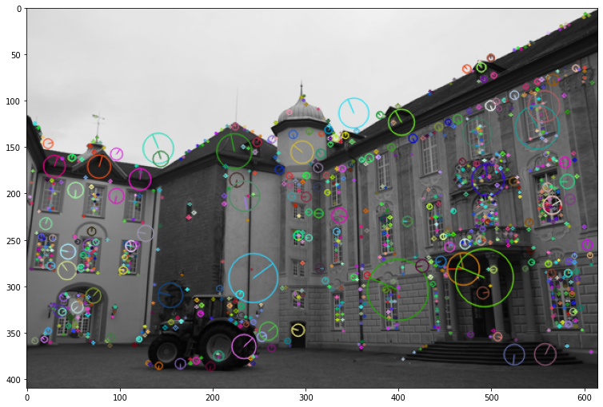
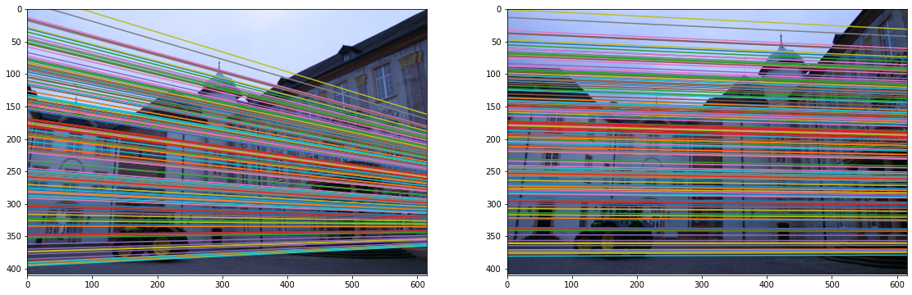
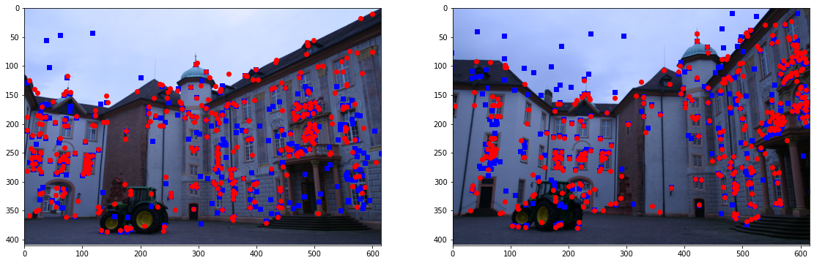

# Recovering 3D transformation between two views

The pipeline consists of-

1. Estimation of essentail matrix using 2 ways:
*  Least squares estimation- Input are calibrated points X1,X2 and I then estimates E using the SVD decomposition method as in the 8-point algorithm
* RANASAC estimation- The estimation of E can be made much more robust by selecting sets of points that reach a common agreement. I have implemented RANSAC algorithm to eliminate outliers and obtain a better estimate of E.

2. Drawing epipolar lines using essential matrix
3. Pose recovery and 3D reconstruction
4. Triangulation

# Outputs
Detected sift points<br/>

<br/><br/>

Matched key points using least square<br/>


Matched key points using RANSAC<br/>


Epipolar lines<br/>


Reprojection from one camera to another<br/>


# Important additional notes

- Please use python 3.7 or earlier (create another virtual env if you are using 3.8 or later). e.g. 
```python
conda create -n cis580_22_fall_py37  python=3.7 # or earlier
source activate cis580_22_fall_py37
cd PATH_TO_code
pip install -r requirements.txt
```
- Please install the requirements in requirements.txt
- If you still meet problem with opencv feature detector, please try earlier version of opencv-contrib